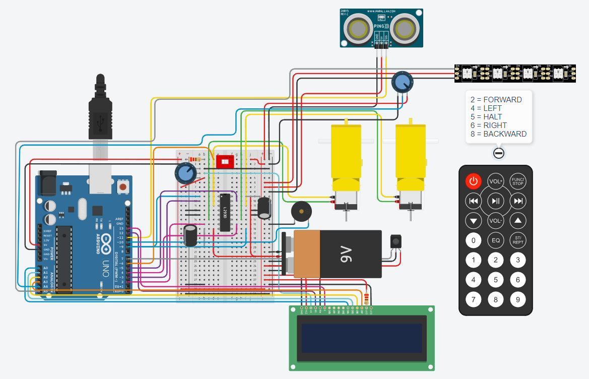
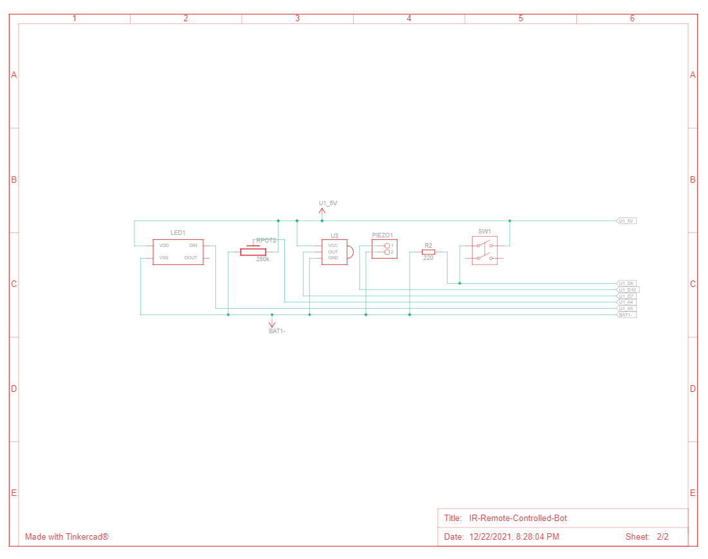

# IR Remote Controlled Bot
An IR remote controlled robot with various features using Arduino.

## Hardware
### Components
* 1 x Arduino UNO R3
* 1 x L293D H-Bridge Motor Driver
* 2 x Hobby Geared Motors
* 1 x DIP Switch (DPST)
* 1 x Piezo Buzzer (small)
* 2 x 220Ohm Resistor
* 2 x 250kOhm Potentiometer
* 2 x 16V 1microFarad Capacitor
* 1 x NeoPixel LED (Strip 4)
* 1 x IR Sensor
* 1 x IR Remote
* 1 x Ultrasonic Distance Sensor (3 pin)
* 1 x LCD (16x2)
* 1 x 9V Battery (2x if Arduino will be portable)

### Circuit Diagram

### Schematic Diagram

 

## Software
### Required Libraries
*Install the following required libraries from the Arduino IDE libraries management window.*
* LiquidCrystal
* IRremote
* Adafruit NeoPixel

**NOTE:** The following code and circuit was tested and simulated using [TinkerCAD](https://www.tinkercad.com/).
