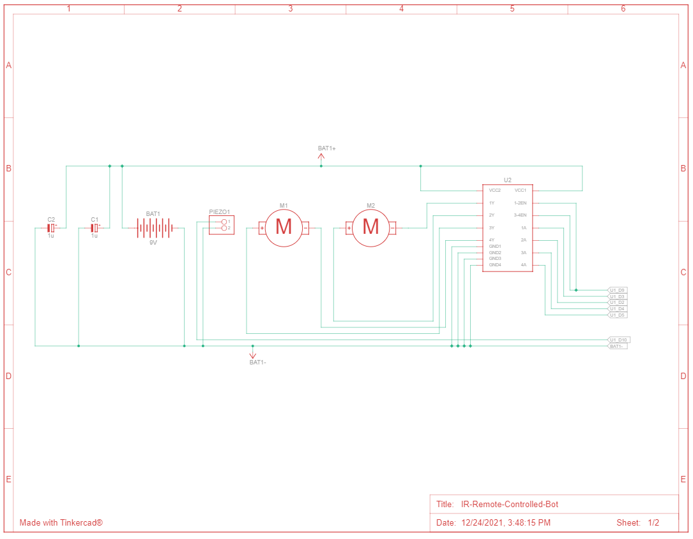
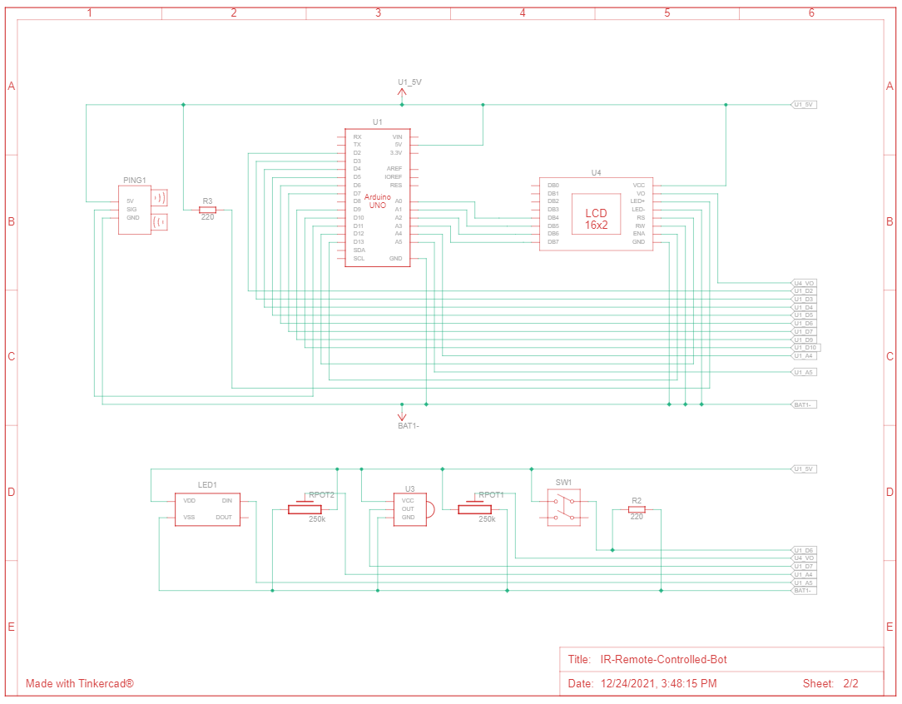

# IR Remote Controlled Bot
An IR remote controlled robot with various features using Arduino.

## Hardware
### Components
* 1 x Arduino UNO R3
* 1 x L293D
* 2 x Geared Motors
* 1 x DIP Switch
* 1 x Piezo Buzzer
* 2 x 250kOhm Potentiometer
* 1 x 16V 1microFarad Capacitor
* 1 x IR Sensor
* 1 x IR Remote
* 1 x Ultrasonic Distance Sensor (3 pin)
* 1 x 9V Battery
* 1 x LCD (16x2)

### Circuit Diagram

### Schematic Diagram

 

## Software
### Required Libraries
*Install the following required libraries from the Arduino IDE libraries management window.*
* LiquidCrystal
* IRremote
* Adafruit NeoPixel

**NOTE:** The following code and circuit was tested and simulated using [TinkerCAD](https://www.tinkercad.com/).
